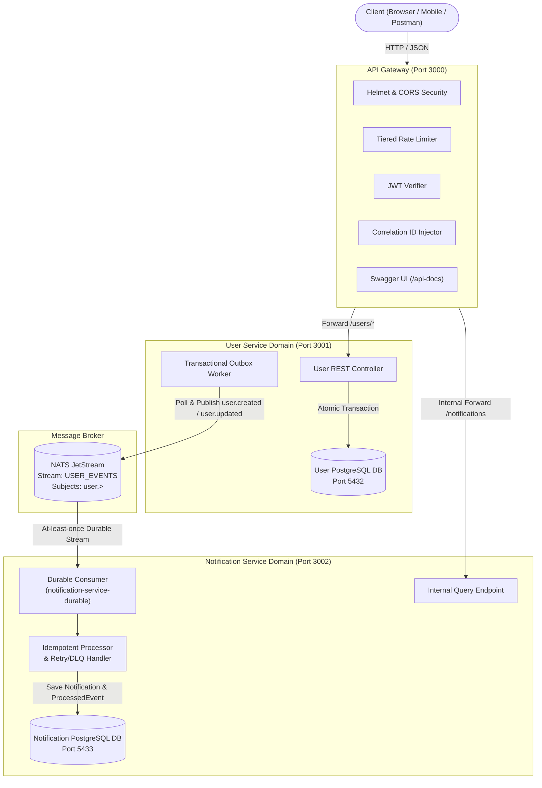

# Production-Grade Event-Driven Microservices System

[](https://nodejs.org/)
[](https://nats.io/)
[](https://www.postgresql.org/)
[](https://www.prisma.io/)
[](LICENSE)

A production-quality distributed microservices system demonstrating **strictly asynchronous, event-driven communication** using **NATS JetStream**, isolated **PostgreSQL databases per service**, **API Gateway** orchestration, the **Transactional Outbox Pattern**, **idempotent message consumption**, **retry & dead-letter queue handling**, **tiered rate limiting**, and **JWT-based authentication**.

---

## Architecture Diagram



---

## 1. High-Level Architecture & Responsibilities

| Service | Primary Role | Data Store | Communication |
| :--- | :--- | :--- | :--- |
| **API Gateway** (`:3000`) | Public entry point, JWT verification, rate limiting, request correlation IDs, reverse proxy, Swagger UI. | Stateless | Ingress HTTP / Egress Forwarding |
| **User Service** (`:3001`) | User registration, login, profile management, password hashing (bcrypt), Transactional Outbox. | PostgreSQL (`user_service_db`) | Publishes to NATS JetStream |
| **Notification Service** (`:3002`) | Durable stream consumption, idempotent notification generation, retry/DLQ management. | PostgreSQL (`notification_service_db`) | Consumes from NATS JetStream |
| **NATS JetStream** (`:4222`) | High-performance, distributed, persistent message broker. | Disk / Stream (`USER_EVENTS`) | JetStream Pub/Sub |

---

## 2. Core Architectural Principles

### 🚫 Non-Negotiable Constraint: Zero Inter-Service REST / WebSockets
> **The User Service and Notification Service NEVER communicate directly via REST APIs, WebSockets, or shared databases.**
>
> All state synchronization occurs asynchronously via **NATS JetStream** events (`user.created`, `user.updated`). The Notification Service only exposes an internal query endpoint (`GET /notifications`) consumed strictly by the API Gateway to serve authenticated client queries.

### 📦 Transactional Outbox Pattern (Dual-Write Protection)
In distributed systems, updating a database and publishing a message in separate calls creates a **dual-write failure risk** (the database write succeeds, but the message publish fails due to network outage or broker restart).

To guarantee 100% consistency:
1. When a user registers or updates their profile, the User Service executes a single **Prisma atomic database transaction** that writes both the `User` record and an `OutboxEvent` record (`status: 'PENDING'`).
2. An asynchronous publisher fires the event to NATS JetStream.
3. If the broker is temporarily unreachable, an autonomous background **Outbox Poller** automatically sweeps and retries all `PENDING` outbox records once the broker recovers.

### 🔁 Idempotent Event Processing
Because distributed messaging provides **at-least-once delivery**, events may be redelivered during consumer restarts or transient timeouts.
- Every event contains a unique `eventId` (UUIDv4).
- The Notification Service records every processed `eventId` in the `processed_events` table inside a database transaction.
- If an event arrives with an `eventId` that already exists, the Notification Service skips duplicate notification creation and immediately **acknowledges (ACKs)** the message.

### 🛡️ Retry Policy & Dead Letter Queue (DLQ)
- **Consumer**: Durable push/pull consumer `notification-service-durable` on stream `USER_EVENTS`.
- **Acknowledgment**: Explicit ACK (`AckPolicy.Explicit`).
- **Retries**: If processing throws an unexpected error, a negative acknowledgment (`msg.nak(1000)`) triggers delayed redelivery.
- **Dead Letter Handling**: If delivery attempts reach `max_deliver: 3`, the event is persisted into `dead_letter_events` with error diagnostic metadata, and explicitly ACKed to prevent poison-pill blocking of the stream.

---

## 3. Database Isolation (Database-per-Service)

Each service controls its own PostgreSQL instance with dedicated Prisma schemas:

```text
User Service                   Notification Service
      │                                 │
      ▼                                 ▼
┌──────────────────┐            ┌──────────────────────┐
│  user_service_db │            │notification_service_db│
├──────────────────┤            ├──────────────────────┤
│ • users          │            │ • notifications      │
│ • outbox_events  │            │ • processed_events   │
│                  │            │ • dead_letter_events │
└──────────────────┘            └──────────────────────┘
```

---

## 4. Security & Hardening

* **Password Security**: Passwords hashed using `bcrypt` (10 salt rounds). Plaintext passwords are never logged or returned.
* **JWT Authentication**: Signed with HMAC-SHA256, containing strictly non-sensitive claims (`sub`, `email`, `iat`, `exp`).
* **API Gateway Security**:
  * **Helmet**: Secure HTTP header management (CSP, HSTS, XSS filtering).
  * **CORS**: Configurable origin controls.
  * **Tiered Rate Limiting**: General endpoint limiter (100 req/min) and strict brute-force protection for `/api/users/login` (15 req/15min).
* **Internal Service Isolation**: Internal query endpoints on Notification Service require `X-Internal-API-Key` injected only by the Gateway.
* **Correlation Tracking**: `X-Correlation-ID` & `X-Request-ID` propagated throughout all HTTP requests and JetStream event envelopes.

---

## 5. Quickstart & Setup Guide

### Prerequisites
* [Docker Desktop](https://www.docker.com/products/docker-desktop/) (v24+) & Docker Compose (v2+)
* [Node.js](https://nodejs.org/) v20+ or v22+ (for running tests locally)

### Step 1: Clone and Configure Environment
```bash
git clone <repo-url>
cd Trams

# Copy root environment variables
cp .env.example .env
```

### Step 2: Start the System with Docker Compose
```bash
docker compose up --build -d
```

Docker Compose will automatically:
1. Start NATS Broker with JetStream enabled (`:4222`, monitoring on `:8222`).
2. Spin up `user-db` (Postgres `:5432`) and `notification-db` (Postgres `:5433`).
3. Run Prisma migrations on both databases.
4. Launch `user-service` (`:3001`), `notification-service` (`:3002`), and `api-gateway` (`:3000`).

Check container health:
```bash
docker compose ps
```

---

## 6. API Documentation & Interactive Swagger UI

Open your browser and navigate to:
👉 **`http://localhost:3000/api-docs`**

### Summary of Endpoints

| Method | Endpoint | Description | Auth Required |
| :--- | :--- | :--- | :--- |
| `GET` | `/health` | Gateway Liveness Check | No |
| `GET` | `/ready` | System-wide Readiness Check (Services, DBs, NATS) | No |
| `POST` | `/api/users/register` | Register user & publish `user.created` event | No (Rate-limited) |
| `POST` | `/api/users/login` | Authenticate & obtain JWT | No (Rate-limited) |
| `GET` | `/api/users/me` | Fetch authenticated user profile | Yes (Bearer JWT) |
| `PATCH` | `/api/users/me` | Update profile & publish `user.updated` event | Yes (Bearer JWT) |
| `GET` | `/api/users/:id` | Fetch user profile by ID | Yes (Bearer JWT) |
| `GET` | `/api/notifications` | Fetch notifications for authenticated user | Yes (Bearer JWT) |
| `GET` | `/api/notifications/:id` | Fetch single notification by ID | Yes (Bearer JWT) |

---

## 7. Running Tests

### 1. Run Unit Tests for All Services
```bash
# User Service Unit Tests
npm test --prefix user-service

# Notification Service Unit Tests
npm test --prefix notification-service

# API Gateway Unit Tests
npm test --prefix api-gateway
```

### 2. Run Automated End-to-End (E2E) Test Suite
With the Docker containers running:
```bash
npm run test:e2e
```

The E2E suite verifies:
1. Gateway health and system-wide dependency readiness.
2. User registration and atomic outbox creation.
3. Duplicate registration conflict rejection (409).
4. User login & password verification.
5. Authenticated profile retrieval and updates.
6. Asynchronous NATS JetStream event consumption and notification persistence.
7. Invalid JWT rejection on protected routes.

---

## 8. Failure Handling & Resilience Matrix

| Failure Scenario | System Behavior & Recovery Strategy |
| :--- | :--- |
| **NATS Broker Down during Registration** | User registration succeeds in User DB. Event is persisted atomically as `PENDING` in `outbox_events`. Once NATS recovers, the background Outbox Poller publishes all pending events without data loss. |
| **Notification Service Down when User Registers** | Event is published to NATS JetStream and stored durably in the stream on disk. When Notification Service starts/reconnects, its durable consumer picks up all pending messages from the exact sequence point. |
| **Duplicate Event Replay** | Notification Service checks `processed_events` for `eventId`. The duplicate is detected, skipped, and immediately ACKed, preventing duplicate notifications. |
| **Database Failure** | Service returns clear 503 error with correlation ID. `/ready` endpoint reports unhealthy status without leaking connection strings or internal credentials. |

---

## 9. Future Production Improvements

1. **Kubernetes Orchestration**: Helm charts with Horizontal Pod Autoscaling (HPA) and readiness/liveness probes.
2. **mTLS & NKey Authentication**: Upgrade internal NATS and HTTP connections to mutual TLS and cryptographic NKey authentication.
3. **OpenTelemetry (OTel)**: Distributed tracing propagation across HTTP headers and NATS JetStream message metadata into Jaeger/Zipkin.
4. **Prometheus & Grafana**: Service metrics exporter (`http_requests_total`, `nats_messages_processed_total`, `consumer_lag`).
